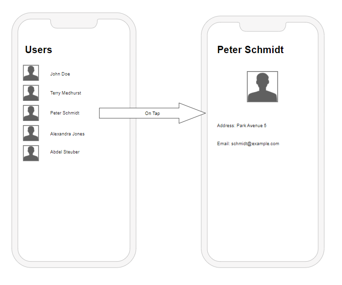

# Work Sample

This is a mostly empty sample [Flutter](https://flutter.dev/) project. 

To get started, you should look at the [documentation](https://docs.flutter.dev/get-started/install) to install flutter on your machine. You can then run the project in an emulator or on a real device.

As a development environment, we recommend [Visual Studio Code](https://code.visualstudio.com/) with the [Flutter extension](https://marketplace.visualstudio.com/items?itemName=Dart-Code.flutter). However, you are free to use any IDE you want.

Note that flutter is a cross-platform library, but we are currently primarily interested in the mobile part. Thus, please limit yourself to the mobile app development part. 
In particular, the android part is sufficient for this task, and you need not take care of the iOS part. Moreover, you do not need to take care of web or desktop platforms.

## Setup

To get started, you should fork this repository and clone it to your local machine. You can then open the project in your IDE and run it.

## Implementation tasks
Please perform the following tasks:

1. Retrieve a list of users using the [dummy JSON API](https://dummyjson.com/docs/users)     Limit the number of users to 10. Use the "api_service" class that is already provided. To access this service, the ["Riverpod"](https://riverpod.dev/docs/introduction/why_riverpod) library is used and you can see how to access the "api_service" in the "user_list_view.dart" file. 

2. Display the list of users in a list view. Each list item should display the user's name and avatar

3. When tapping on a list item, display a new screen that shows the user's details. The details should include at least the name, but you are also free to include any other details you think are relevant.

Here is a wireframe of the final result:

Your result should have the same functionality, but you are free to style it however you want.

## Design of the app

We encourage you to style the app in a child-friendly way. You are free to use any design you want.

## Submission

Finish your solution until Wednesday, 24:00h.
Please send us the name of your repository and the link to it.
The project should be runnable without any additional steps. If you need to add any additional steps, please include them in a README file. 
Please take care that the project compiles and runs without any errors.

## Questions

If you have any questions about the task, write an email to [d.biedermann@dipf.de](mailto:d.biedermann@dipf.de) and [j.breitwieser@dipf.de](mailto:j.breitwieser@dipf.de)